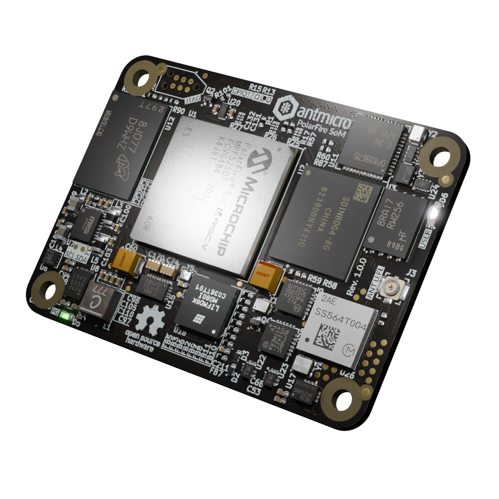

# PolarFire SoM

Copyright (c) 2023-2024 [Antmicro](https://www.antmicro.com)

## Overview

This project contains open hardware design files for the Antmicro PolarFire System on Module (SoM) built around Microchip [PolarFire MPFS250T](https://www.microchip.com/en-us/product/mpfs250t) RISC-V System on Chip.
The SoM exposes two 100-pin high density connectors with signal assignment that is electrically compatible with [Raspberry Pi Compute Module 4](https://datasheets.raspberrypi.com/cm4/cm4-datasheet.pdf).

The PCB design files were prepared in KiCad 7.

## Key features

* PolarFire SoC MPFS250T
* 2 GB LPDDR4-1866 SDRAM
* 8 GB eMMC flash memory
* Gigabit Ethernet PHY (Ti/[DP83867ISRGZR](https://www.ti.com/lit/gpn/DP83867IS))
* 4-lane PCIe (via MPFS250T built-in XCVR transceivers)
* 2.4 GHz, 5.0 GHz IEEE 802.11 b/g/n/ac WiFi module (Murata/[LBEE5PK2AE](https://www.murata.com/en-eu/products/connectivitymodule/wi-fi-bluetooth/overview/lineup/type2ae))
* Bluetooth 5.2 module (Murata/LBEE5PK2AE)
* HDMI output
* 4-lane MIPI DSI and 4-lane MIPI CSI-2 exposed via Lattice [CrossLink](https://www.latticesemi.com/Products/FPGAandCPLD/CrossLink) (LIF-MD6000-6JMG80I) companion IC
* Additional 2-lane MIPI CSI-2 camera port, when working in 1.8V logic
* On-board power sequencing and voltage regulation based on a single 5V supply

## Project structure

The main directory contains KiCad PCB project files, a LICENSE, and a README.
The remaining files are stored in the following directories:

* `doc` - contains schematics in PDF format
* `assets` - contains visual assets for showcasing this design on [Open Hardware Portal](https://openhardware.antmicro.com).

## Licensing

This project is published under the [Apache-2.0](LICENSE) license.
